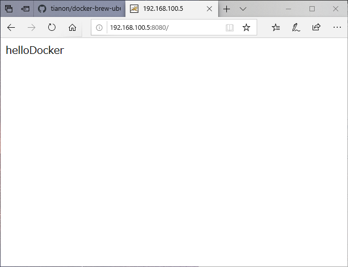

## 删除镜像

```bash
root@andre:~# docker image rm 927899a31456
root@andre:~# docker image rm ubuntu:16.04
root@andre:~# docker image rmi 927899a31456
```

+ 进入tomcat目录，并且运行 

```bash
root@andre:~# docker run -it tomcat bash
root@9a410f00fd30:/usr/local/tomcat# ls -al
```

+ 先删除已经运行好的所有tomcat,

```bash
root@andre:~# docker ps -a
CONTAINER ID        IMAGE               COMMAND             CREATED              STATUS                          PORTS               NAMES
4a2cbdd18b1e        tomcat              "catalina.sh run"   About a minute ago   Exited (130) 4 seconds ago                          angry_hoover
049fb5107d30        tomcat              "bash"              4 minutes ago        Exited (0) About a minute ago                       sharp_wozniak
root@andre:~# docker rm 4a2cbdd18b1e 049fb5107d30

```

+ 运行一个新的tomcat  
  - 先运行
  - 然后以交互的方式打开另外一个终端,根据容器ID进入容器

```bash
root@andre:~# docker run -p 8080:8080 tomcat
```

​         + 打开另外一个   exec命令 就是表示进入的意思

```bash
root@andre:~# docker ps -a
CONTAINER ID        IMAGE               COMMAND             CREATED             STATUS              PORTS                    NAMES
e9a1b3dd7029        tomcat              "catalina.sh run"   18 seconds ago      Up 17 seconds       0.0.0.0:8080->8080/tcp   priceless_bhaskara
root@andre:~# docker exec -it e9a1b3dd7029 bash
root@e9a1b3dd7029:/usr/local/tomcat# cd webapps
root@e9a1b3dd7029:/usr/local/tomcat/webapps# mkdir ROOT
root@e9a1b3dd7029:/usr/local/tomcat/webapps# cd ROOT/
root@e9a1b3dd7029:/usr/local/tomcat/webapps/ROOT# echo helloDocker > index.html
root@e9a1b3dd7029:/usr/local/tomcat/webapps/ROOT# cat index.html 
helloDocker

```

