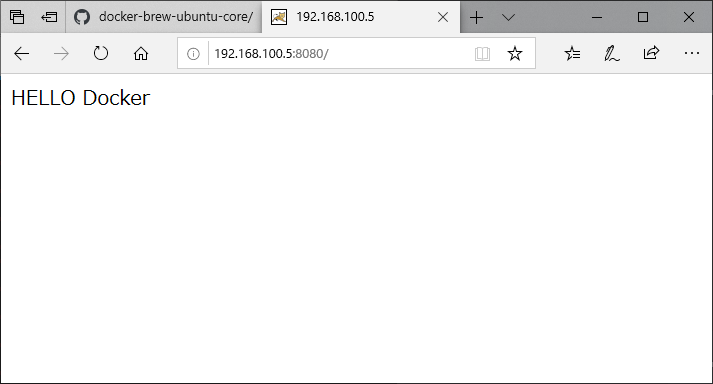

## 定制镜像

**docker真正实现一次构建，到处运行**

```bash
root@andre:/usr/local/docker/tomcat# vim Dockerfile

FROM tomcat
RUN mkdir /usr/local/tomcat/webapps/ROOT
RUN echo "HELLO Docker" > /usr/local/tomcat/webapps/ROOT/index.html
```

+ 构建镜像 

```bash
root@andre:/usr/local/docker/tomcat# docker build -t liukaku .
Sending build context to Docker daemon  2.048kB
Step 1/3 : FROM tomcat
 ---> 927899a31456
Step 2/3 : RUN mkdir /usr/local/tomcat/webapps/ROOT
 ---> Running in 58a5e9605eb6
Removing intermediate container 58a5e9605eb6
 ---> b8381b4aff0f
Step 3/3 : RUN echo "HELLO Docker" > /usr/local/tomcat/webapps/ROOT/index.html
 ---> Running in c708a8732ff5
Removing intermediate container c708a8732ff5
 ---> 7f6226c6ba42
Successfully built 7f6226c6ba42
Successfully tagged liukaku:latest

```

+ 镜像构建完成

```bash
root@andre:/usr/local/docker/tomcat# docker images
REPOSITORY          TAG                 IMAGE ID            CREATED              SIZE
liukaku             latest              7f6226c6ba42        About a minute ago   647MB
root@andre:~# docker run -it liukaku bash
root@7fdf34714346:/usr/local/tomcat#
```

+ 再次构建 

```bash
root@andre:/usr/local/docker/tomcat# vim Dockerfile 

FROM tomcat
WORKDIR /usr/local/tomcat/webapps/
RUN rm -rf *
RUN mkdir ROOT
RUN echo "HELLO Docker" > ROOT/index.html
```

+ 删除虚玄镜像

```bash
root@andre:/usr/local/docker/tomcat# docker images
REPOSITORY          TAG                 IMAGE ID            CREATED             SIZE
liukaku             latest              ef8bba075a32        8 seconds ago       647MB
<none>              <none>              7f6226c6ba42        19 minutes ago      647MB
root@andre:/usr/local/docker/tomcat# docker image prune
```

+ 启动定制镜像

```bash
root@andre:/usr/local/docker/tomcat# docker run -p 8080:8080 liukaku
```



