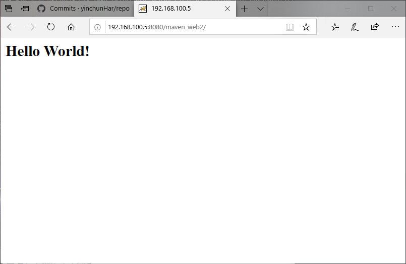

## DockerFile指令

1. 删除已经有的镜像和容器

```bash
root@andre:~# docker rm 79c4055d1bdd
root@andre:~# docker rmi ef8bba075a32
```

2. COPY指令就是拷贝文件 WORKDIR 就是指定工作目录，如果目录不存在则自己创建

```bash
root@andre:/usr/local/docker/tomcat# vim Dockerfile 

FROM tomcat

WORKDIR /usr/local/tomcat/webapps/
RUN rm -rf *
RUN mkdir ROOT
#RUN echo "HELLO Docker" > ROOT/index.html
COPY maven_web2.zip ROOT/
WORKDIR /usr/local/tomcat/webapps/ROOT
RUN unzip maven_web2.zip
RUN rm -rf maven_web2.zip

```

```shell
root@andre:/usr/local/docker/tomcat# docker run -it --rm liukaku bash
root@eb4dd01f44a8:/usr/local/tomcat/webapps/ROOT# ls
maven_web2
root@eb4dd01f44a8:/usr/local/tomcat/webapps/ROOT# cd maven_web2/
root@eb4dd01f44a8:/usr/local/tomcat/webapps/ROOT/maven_web2# ls
META-INF  WEB-INF  hello.jsp  index.jsp

```

